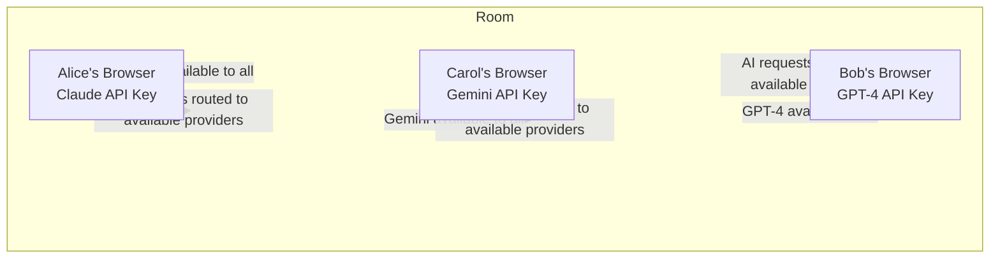

# THISTHAT 🎨✨

**Real-time collaborative canvas with distributed AI superpowers**

Draw together, build together, and share AI resources without sharing API keys. The first collaboration tool where one person's AI becomes everyone's superpower.

🌐 **Live Demo**: [thisthat.fun](https://thisthat.fun)

## 🚀 What is THISTHAT?

THISTHAT is a real-time collaborative workspace where teams can draw, chat, and use AI together on an infinite canvas. Our revolutionary distributed AI system means when one person adds their AI provider, everyone in the room can use it instantly - no more "everyone needs their own API key"!

### 🧠 The Magic: Distributed AI

**Problem**: Traditional AI tools require everyone to have their own API keys, making team collaboration expensive and complicated.

**Our Solution**: Distributed AI through secure room-based sharing
- Alice joins and adds her Claude API key → Everyone can now use Claude
- Bob joins and adds his GPT-4 key → Everyone can now use both Claude AND GPT-4  
- Carol joins with Gemini → The room now has access to all three AI providers
- When Bob leaves → Claude and Gemini still work, only GPT-4 goes offline

**Benefits**:
- 🔐 **Secure**: API keys never leave the owner's browser (Supabase RLS)
- 💰 **Fair**: Each person contributes their own AI credits
- 🤝 **Collaborative**: Mix and match AI providers in real-time
- 🔄 **Resilient**: No single point of failure

### 🗺️ Distributed AI Architecture



### ✨ Key Features

#### 🎨 **Infinite Collaborative Canvas**
- Draw, sketch, and annotate together in real-time
- See live cursors of all participants
- Drag and arrange AI responses spatially
- Visual thinking meets AI assistance

#### 🤖 **Multi-Provider AI Integration**
- **Claude 3.5** - Advanced analysis and coding
- **GPT-4** - General assistance and creativity  
- **Gemini Pro** - Google's latest AI capabilities
- Use multiple AI providers simultaneously
- AI responses appear as draggable cards on canvas

#### 👥 **Real-Time Collaboration**
- Join rooms with simple 8-character codes
- See who's in the room with avatar indicators
- Built-in chat with @ai, @gpt, @claude commands
- Everything syncs instantly across all users

#### 🎬 **Screen Recording & Gallery**
- Record your collaborative sessions
- Share recordings to public gallery
- Get +10 minutes free collaboration time per share
- Showcase your team's creative process

#### ⏱️ **Fair Monetization**
- 1 hour free when 2+ people join
- Pay-as-you-go with Buy Me a Coffee
- Time added benefits everyone in the room
- No subscriptions, just coffee ☕

## 🎯 Use Cases

- **Remote Teaching**: Teacher adds AI, all students can use it for explanations
- **Startup Teams**: Share expensive AI tools without sharing costs unfairly
- **Design Reviews**: One designer's Claude account helps the whole team
- **Study Groups**: Pool AI resources for better learning
- **Hackathons**: Rapid prototyping with shared AI capabilities

## 🛠️ Tech Stack

- **Frontend**: Next.js 14, React, TypeScript, TailwindCSS
- **Real-time**: Supabase (Broadcast, Presence, Database, RLS)
- **Canvas**: HTML5 Canvas with custom drawing engine
- **AI Providers**: Anthropic, OpenAI, Google AI SDKs
- **UI Components**: shadcn/ui
- **Media**: MediaRecorder API for session recording
- **Payments**: Buy Me a Coffee + Zapier webhook integration
- **Architecture**: Hybrid P2P + Supabase for optimal performance

## 🚀 Getting Started

### Prerequisites
- Node.js 18+
- npm or yarn
- Supabase project (for real-time backend)

### Installation

```bash
# Clone the repository
git clone https://github.com/yourusername/thisthat-project.git
cd thisthat-project

# Install dependencies
npm install

# Set up environment variables
cp .env.example .env.local
# Add your Supabase credentials

# Run the development server
npm run dev
```

### Environment Variables

Create a `.env.local` file with the following variables:

```env
NEXT_PUBLIC_SUPABASE_URL=your_supabase_url
NEXT_PUBLIC_SUPABASE_ANON_KEY=your_supabase_anon_key
```

🚧 Coming Soon
- Spatial object improvements
- Voice chat integration
- More canvas tools like shapes
- File Storage
- More AI providers (Perplexity, Midjourney, Deepseek)
- Enhancements on previewing designs and outputs
- Export canvas as image/PDF

🏆 Awards & Recognition
Built for the Bolt.new Hackathon - showcasing the future of collaborative AI tools.

🙏 Acknowledgments

Built with Bolt.new
Powered by Supabase
UI components from shadcn/ui
Deployed on Vercel
